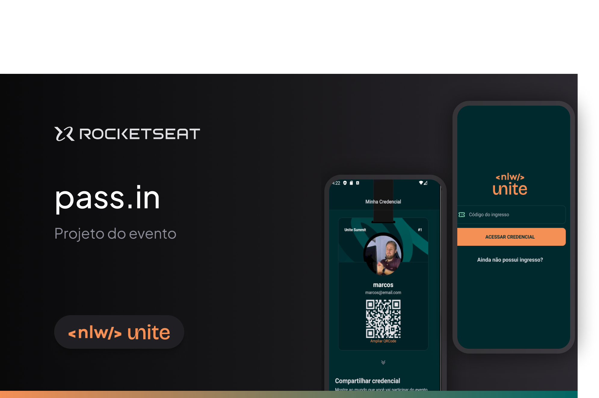
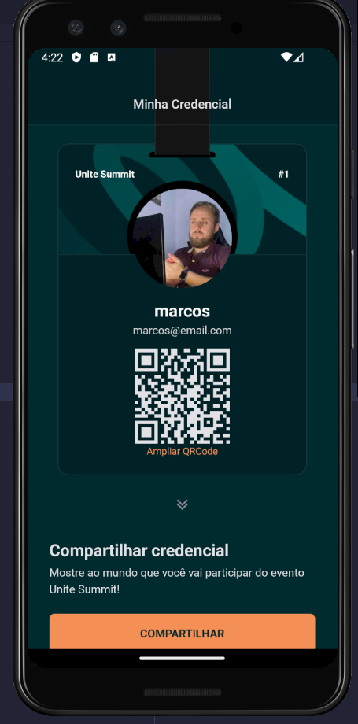

---

### Desing do Projeto - Figma

[Figma - Ignite Teams](https://www.figma.com/community/file/1356738933008624188)

---

## Descrição

O Ignite Teams é um projeto desenvolvido durante a NLW. Ele oferece uma aplicativo para cadastro em um evento com seu ticket exclusivo. O APP conta com funcionalidades de cadastro no evento, visualização do ticket excluso e qr para autenticação do usuário no evento, link para compartilhamento do ticket do evento.

## Funcionalidades 🛠️

- Criar um ticket
- Área exclusiva do usuário com ticket exclusivo
- Compartilhamento do ticket exclusivo
- Remoção do ticket exclusivo salvo no seu dispositivo móvel

## Tecnologias Utilizadas 💻

- React Native
- Type Script
- Expo
- Tailwind
- Expo react-navigation
- Async Storage
- Reamimant
- Lib. Moti para Reanimated

## Como Usar 🚀

### Pré-requisitos ✅

- Node.js
- npm ou yarn
- Expo CLI

### Instalação 📦

1. Clone o repositório:

```
git clone https://github.com/anjosmarcos/nlw-unite

```

2. Navegue até o diretório do projeto:

```
cd nlw-unite

mobile:
1. cd nlw-unite/mobile
2. npm install
3. npm start --clear

server:
1. cd nlw-unite/server
2. npm install
3. npm run dev

```



### Execução ▶️

Com emulador do android ou smartphone escaneie o QRcode para carregar aplicação

## Contribuição 🤝

Contribuições são bem-vindas! Se você quiser contribuir com melhorias, novas funcionalidades ou correções de bugs, sinta-se à vontade para abrir uma issue ou enviar um pull request.

## Licença 📝

Este projeto é licenciado sob a [Licença MIT](https://opensource.org/licenses/MIT).

---
